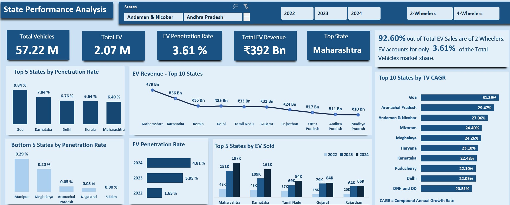
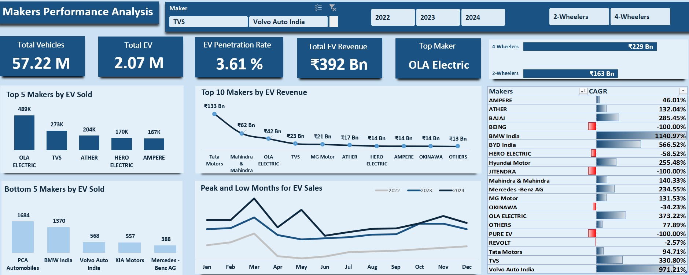

# EV_Market_Analysis

## Problem Statement
**AtliQ Motors** is an automotive giant from the USA specializing in electric vehicles (EV). In the last 5 years, their market share rose to **25% in electric and hybrid vehicles segment in North America**. As a part of their expansion plans, they wanted to launch their bestselling models in India where their market share is **less than 2%**. **Bruce Haryali, the chief of AtliQ Motors India wanted to do a detailed market study of existing EV/Hybrid market in India before proceeding further.** 

## Domain
**Automotive**

## Task
Analyse data and provide insights to an Automotive company on Electric Vehicles launch in India.To conduct a comprehensive analysis of the existing EV/Hybrid vehicle market in India, gain insights into market dynamics, and identify strategic opportunities for AtliQ Motors to expand its presence. The objective is to enhance market share by effectively introducing their bestselling models in this growing segment.
### Desirable Insights from this analysis
* List the top 3 and bottom 3 makers for the fiscal years 2023 and 2024 in terms of the number of 2-wheelers sold.
* Identify the top 5 states with the highest penetration rate in 2-wheeler and 4-wheeler EV sales in FY 2024.
* What are the peak and low season months for EV sales based on the data from 2022 to 2024?
* List down the top 10 states that had the highest compounded annual growth rate (CAGR) from 2022 to 2024 in total vehicles sold.
* Which state of India is ideal to start the manufacturing unit?

 ## Skills Used
 **Excel(Advanced Excel)**

 ## Key Metrices
 * CAGR (Compound Annual Growth Rate)
 * PR (Penetration Rate) - Represents the % of Electric Vehicle out of total vehicles withtin a specific region or category
 * Market Share and Revenue Growth

 ## Process
 * Import the data into Excel and perform data cleaning and manipulation using **VLOOKUP, Power Query and various date functions**.
 * Analyze the data using **PivotTables** and apply **conditional formatting** for better insights and create interactive dashboards for visualization.

 ## State Performance Analysis  

 ## Makers Performance Analysis 

 ## Conclusion and Recommendations 
 * Average EV Penetration Rate for last 3 Fiscal Years is **3.6%**.Notably, states such as **Maharashtra, Karnataka, Kerala, and Tamil Nadu** have consistently performed above this national average. **Goa**
   stands out with the highest average EV penetration rate at **9.8%**, indicating a strong regional adoption of electric vehicles.
 * Given the significantly higher EV penetration rates in states like Goa (9.8%), Maharashtra, Karnataka, Kerala, and Tamil Nadu, the company should prioritize market expansion and investment in these regions. 
   These states demonstrate strong consumer readiness and infrastructure support for EV adoption.
 * States such as **Manipur, Meghalaya, Arunachal Pradesh**, and **Nagaland** have recorded the lowest EV penetration rates, while **Sikkim** has reported **zero EV penetration** over the last three fiscal years.
   May be **Geographical terrain** in these states pose challenges, potentially impacting accessibility, infrastructure development, and logistical operations.
 * To improve EV penetration in these states, the company can **Collaborate with state governments to promote EV awareness and infrastructure development**.
 * The EV market has grown nearly **fourfold** in terms of penetration from **2022 to 2024**, suggesting rising consumer acceptance, better infrastructure, or stronger government incentives.
 * Although two-wheelers account for **92.6%** of the total EV sales volume, **four-wheelers contribute more significantly in terms of revenue**.This reflects the higher unit cost of four-wheelers, indicating 
   that while two-wheelers dominate in quantity, four-wheelers drive the majority of value in the EV market.
 * So company should expand product offerings and marketing efforts in the four-wheeler EV segment to capitalize on higher revenue potential per unit and continue investing in the two-wheeler segment to maintain 
   and grow market share, especially in tier-2 and tier-3 cities where affordability and convenience drive demand.
 * **Ola Electric** is the leading manufacturer in terms of EV sales, primarily driven by its dominance in the two-wheeler segment. **Tata Motors**, on the other hand, holds a strong position in the four-wheeler 
   EV market and leads in terms of revenue generation.
 * **March** consistently emerges as the peak month for electric vehicle (EV) sales across multiple years, indicating a seasonal surge in consumer demand. The company should strategically align its marketing 
   campaigns, promotional offers, and inventory planning to capitalize on this seasonal peak. Initiatives such as year-end discounts, exchange benefits, and targeted digital advertising during February and early 
   March can further enhance sales performance.
 * **Goa, Arunachal Pradesh, and Andaman and Nicobar Islands** exhibit a very **high Compound Annual Growth Rate (CAGR)**, indicating emerging and growing markets. Goa, however, is an exception, as the other 
   states have relatively low penetration rates, providing significant room for adoption and expansion.

